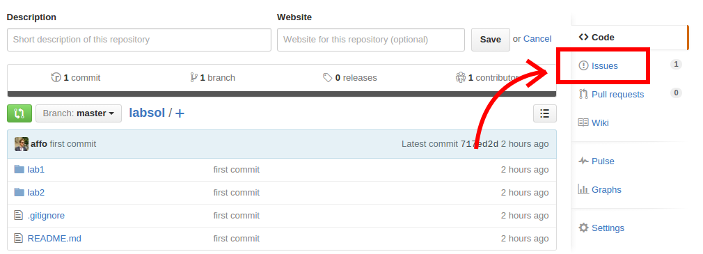

# Soluzioni degli Esercizi di Laboratorio
_Corso di Informatica A_  
_A.A. 2015/2016_

Questa [repository](https://en.wikipedia.org/wiki/Software_repository) contiene le soluzioni
degli esercizi di laboratorio proposti durante le sessioni tenute in classe.

Le soluzioni verranno pubblicate poco prima della successiva sessione di laboratorio con questo criterio:  
le soluzioni del laboratorio _X_ verranno pubblicate il giorno prima (o il giorno stesso) in cui si terr&agrave;
la prima delle sessioni del laboratorio _X + 1_.

Per ogni sessione di laboratorio di cui sono gi&agrave; state pubblicate le soluzioni esiste la cartella `labX`
dove _X_ &egrave; il numero della sessione di laboratorio corrispondente. All'interno della cartella
sono contenuti _N_ file `.c` per _N_ corrispondenti esercizi previsti per quella sessione. La numerazione
dei file segue quella degli esercizi proposti nel file `.pdf`.

### Cosa posso fare con questa _repo_?
1. Puoi __consultarla__.  
Puoi quindi aprire i singoli file `.c` e leggere il codice sorgente
aggiornato alla sua ultima versione, per avere con un confronto con una soluzione diversa da
quella che tu __hai gi&agrave; elaborato__ precendemente.

2. Puoi __scaricarla__.  
Cos&igrave; otterrai i file contenenti il codice sorgente (i `.c`) e potrai aprirli nel
tuo ambiente di sviluppo (e.g. DevC++) per compilarli ed eseguirli.  
Per farlo, basta cliccare su _Download ZIP_ in basso a destra.

### Perch&eacute; una _repo_?

* Grazie a GitHub, &egrave; disponibile in ogni istante usando un comune web browser;
* Il codice &egrave; consultabile direttamente dal browser (anche da _mobile_) e non deve essere scaricato;
* Il codice &egrave; sempre aggiornato all'ultima versione e conserviamo uno "storico" delle versioni
(vedi [version control](https://en.wikipedia.org/wiki/Version_control)).

Oltre a queste -- gi&agrave; di per s&egrave; pi&ugrave; che sufficienti -- motivazioni, potrai ricevere __notifiche in tempo reale__
sullo stato delle soluzioni del laboratorio, semplicemente cliccando _Watch_ in alto a destra.

Infine, potrai aprire un __issue__ in caso tu abbia trovato un errore in una soluzione (il mio codice
non &egrave; vangelo; anzi, troverete sicuramente degli errori), oppure tu abbia dei dubbi in merito.

Prima di aprire un _issue_ __leggi attentamente la guida sottostante__.

## Come scrivere un _issue_
Per aprire un _issue_ basta cliccare in alto a destra:

A questo punto, baster&agrave; dare un titolo rappresentativo del proprio problema e, successivamente, descriverlo __avendo cura di
specificare a quale sessione di laboratorio e a quale esercizio ci si riferisce__.

Gli issue vengono scritti in [Markdown](http://daringfireball.net/projects/markdown/), quindi ti consigliamo di
seguire [questo tutorial](http://markdowntutorial.com/) (durata: circa 5 minuti).  
Per un esempio di _issue_, clicca [qui](https://github.com/affo/labsol/issues/1).

### Le regole
__NON__ verranno accettati _issue_ che corrispondano a questi criteri:

1. Riferimenti ad esercizi per cui __non &egrave; stata ancora fornita una soluzione__. Possiamo solo discutere su codice
che esiste sulla _repo_;
2. _Issue_ contenti una "spataffiata" di codice e con un'unica domanda: "perch&eacute; non compila?". La sintassi del linguaggio
C pu&ograve; essere appresa ovunque e il compilatore &egrave; chiaro su dove si trovino i problemi di sintassi;
3. _Issue_ contenti una "spataffiata" di codice e con un'unica domanda: "secondo te va bene?". Dovete essere voi a capire
se avete commesso un errore oppure no. Non possiamo di certo correggere tutti gli esercizi di tutti gli iscritti al corso;

Vi ricordiamo che appartenete ad una comunit&agrave; di studenti, di conseguenza, le norme del buonsenso e del rispetto vigono
come sempre.
